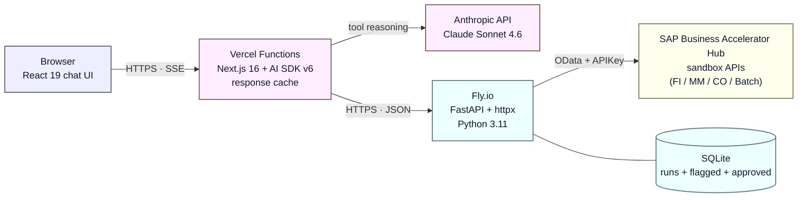
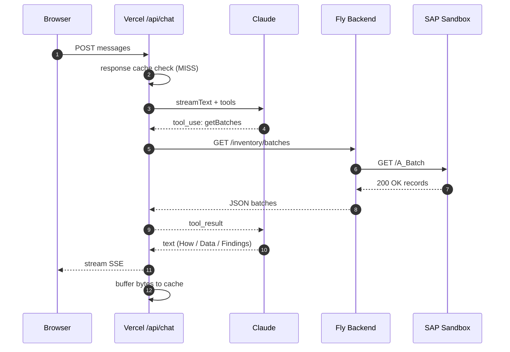
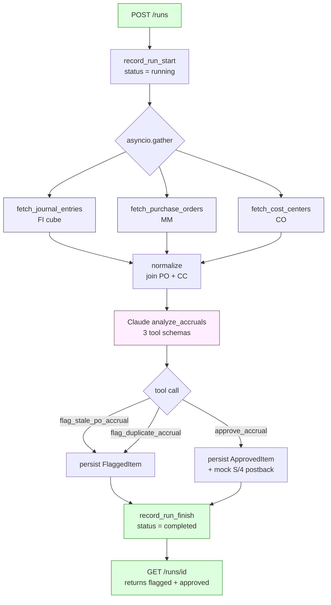

# Accrual Engine
## AI-Powered Finance Operations on SAP

A chat-first agent that handles the month-end accrual and inventory-review
workload finance teams currently do by hand.

Live: <https://accuralsap.vercel.app> · Backend: <https://accrualagent.fly.dev>

---

## The Problem

Finance teams spend significant time **manually extracting, classifying, and posting** accrual data from multiple sources.

- Pulling data from FI / MM / CO across periods
- Identifying duplicates, stale POs, stalled commitments
- Comparing actuals vs plan for variance analysis
- Flagging distressed pharma inventory (expired / quarantined / slow-moving)
- Posting approved accruals back to S/4

**Cost:** labor-intensive, error-prone, a bottleneck at month-end close,
growing compliance risk.

---

## The Solution

An agent that automates extraction, classification, and posting using
real-time SAP data and LLM reasoning.

<div class="cols">

**For the user**
- Ask a question in plain English
- Agent queries SAP in real time
- Claude reasons over the data
- Gets a structured, auditable answer

**For the auditor**
- Every answer shows *how* it was derived
- Full underlying data returned as a table
- Tool-call inputs + outputs inspectable and downloadable

</div>

---

## What the Agent Can Answer

- **Current-period accruals** — what's ready to post, what's flagged
- **Anomaly detection** — duplicate accruals, stale POs not fully invoiced
- **Actuals vs plan** — variance analysis with budget context
- **Period comparisons** — Jan 2025 vs Jan 2024, YoY by GL range
- **Cost-center drill-downs** — "which cost centers over budget?"
- **Pharma distressed inventory** — expired batches, quarantined lots, slow-moving SKUs
- **Post to S/4** — triggers the mock postback behind a confirmation gate

---

## Concept — Accruals

Accruals are **expenses recognized before the invoice arrives**.

<div class="cols">

**Examples (GL 22xxxxxx):**
- Office rent (April 2026) — service received, invoice pending
- Q2 digital marketing campaign — vendor work done, not billed
- Internet / communications — monthly recurring
- Professional services — consulting engagements
- Travel & entertainment

**Key fields the engine tracks (13 business attributes):**
Company code, Posting Date, Document Date, GL Account #, GL Description, Vendor #, Vendor Name, Short Text, Long Text, Accrual From Period, Accrual To Period, Amount (USD)

</div>

---

## Concept — Distressed Inventory (Pharma)

Inventory that **shouldn't be sold** or needs **immediate review**. Pharma
is the canonical case because regulatory and safety stakes are highest.

| Signal | Business meaning | SAP field |
|---|---|---|
| **Expired** | SLED already past | `ShelfLifeExpirationDate` < today |
| **Near expiry** | SLED within 90 days | `ShelfLifeExpirationDate` < today + 90d |
| **Quarantine** | Blocked pending quality release | `MatlBatchIsInRstrcdUseStock` = true |
| **Marked for deletion** | Flagged for write-off | `BatchIsMarkedForDeletion` = true |
| **Slow-moving** | No movement in 365+ days | `LastGoodsReceiptDate` < today - 365d |

Demo dataset: 25 pharma SKUs across Frankfurt / New Jersey / Bangalore plants.

---

## Technical Architecture



- **Browser → Vercel**: server-side rendering, no SAP keys in client bundle
- **Vercel → Fly**: all tools hit Fly over the public URL (no CORS required)
- **Fly → SAP**: `APIKey` header auth, retries on 5xx, MOCK_MODE fixtures for dev

---

## Tech Stack

<div class="cols">

**Frontend (Vercel)**
- Next.js 16 App Router
- React 19 · TypeScript
- Tailwind CSS v4
- shadcn/ui components
- AI SDK v6 (`@ai-sdk/react` + `@ai-sdk/anthropic`)
- `react-markdown` + `remark-gfm` for streaming tables
- Response cache (in-memory LRU, 30-min TTL)

**Backend (Fly.io)**
- FastAPI + `uvicorn`
- `httpx.AsyncClient` for parallel SAP fetches
- Pydantic v2 models (strict at boundary)
- SQLAlchemy 2.0 · SQLite
- `structlog` for structured logs
- Anthropic Python SDK
- Jinja2 prompt templates

</div>

<span class="small">Python: 50 tests passing, mypy --strict clean on 18 source files. TypeScript: build clean, `tsc --noEmit` passes.</span>

---

## Data Sources — SAP Business Accelerator Hub

All APIs accessed via `sandbox.api.sap.com` with an `APIKey` header (free tier). No SAP tenant required.

| Module | API / Entity | Purpose |
|---|---|---|
| **FI** | `API_OPLACCTGDOCITEMCUBE_SRV` / `A_OperationalAcctgDocItemCube` | Journal entry line items with posting date, amount, GL, cost center, PO linkage (271 fields available) |
| **MM** | `API_PURCHASEORDER_PROCESS_SRV` / `A_PurchaseOrderItem` | PO line items with supplier, SES / goods-receipt dates, invoice status |
| **CO** | `API_COSTCENTER_SRV` / `A_CostCenter` | Cost-center master data for tagging |
| **Inventory** | `API_BATCH_SRV` / `Batch` | Batch master with SLED, manufacture date, quarantine flag, supplier |
| **Inventory** | `API_MATERIAL_STOCK_SRV` / `A_MatlStkInAcctMod` | Current on-hand stock by material / plant / storage location |

Plan / budget data is synthetic (720-row fixture across 2024–26 × 4 cost centers × 5 GL ranges).

---

## Data Definitions — AccrualObject (13 fields)

Business-shaped Python dataclass (Pydantic), translated from SAP's PascalCase cube schema.

```python
class AccrualObject(BaseModel):
    accrual_id: str              # composite key: {co}/{year}/{doc}/{item}
    company_code: str            # e.g. "1010" (BestRun DE)
    posting_date: date | None
    document_date: date | None
    gl_account_number: str       # e.g. "22000000"
    gl_description: str | None   # e.g. "Accrued expenses - rent"
    vendor_number: str | None    # e.g. "V-200"
    vendor_name: str | None      # e.g. "Brightside Marketing Services LLC"
    short_text: str | None       # item-level free text
    long_text: str | None        # header text, fallback to composed description
    accrual_from_period: date    # derived from FiscalPeriod + FiscalYear
    accrual_to_period: date      # first-day to last-day of fiscal month
    amount_usd: Decimal          # from AmountInGlobalCurrency (GlobalCurrency=USD)
    # + joined PO + CC context for Claude's anomaly reasoning
```

---

## Data Definitions — BatchRecord (Pharma)

```python
class BatchRecord(BaseModel):
    batch: str                                  # SAP batch number
    material: str                               # SKU, e.g. "PH-AMX-500"
    material_description: str                   # "Amoxicillin 500mg capsules"
    therapeutic_category: str                   # ANTIBIOTIC | OTC | CHRONIC | ...
    plant: str                                  # 1010 | 1710 | 2010
    plant_name: str                             # "Frankfurt DC"
    shelf_life_expiration_date: date | None     # ← primary distress signal
    manufacture_date: date | None
    last_goods_receipt_date: date | None        # ← slow-moving signal
    is_marked_for_deletion: bool
    is_restricted_use: bool                     # ← quarantine signal
    supplier: str                               # e.g. "V-P002"
    supplier_name: str                          # "Teva Pharmaceutical Industries"
    country_of_origin: str                      # DE, IN, US, CH, IE
    quantity: float
    base_unit: str
```

---

## Approach — LLM Agent with Tools

The agent does **not** receive raw SAP data in its context. Instead, it calls tools.

<div class="cols">

**Agent config**
- Model: `claude-sonnet-4-6` (prod), `claude-haiku-4-5` (dev)
- Framework: AI SDK v6 `ToolLoopAgent`
- Loop: up to 15 steps
- Prompt cache breakpoint on last tool → 90% input-token discount

**Tools available**
- `getAccruals(filters…)` → `GET /accruals`
- `getPlan(filters…)` → `GET /plan`
- `getBatches(distress_signal…)` → `GET /inventory/batches`
- `detectIrregularities()` → `POST /runs` + poll
- `postApprovedAccruals({confirmed})` → gated postback

</div>

Each tool is a thin HTTP wrapper around a Fly endpoint. Claude chooses which, with what parameters.

---

## Approach — Structured, Auditable Responses

Every answer follows a mandatory three-section format enforced by the system prompt:

**`## How I answered this`** — methodology note: which tool(s) called, what filters, why, how many records.

**`## Data`** — full Markdown table of the underlying records. No silent truncation. Includes key identifier columns for cross-checking.

**`## Findings / Recommendation`** — analysis with specific row references, ending with a next action.

<div class="cols">

**Plus UI-level validation:**
- Tool-call badges are **expandable**
- Shows raw parameters + raw JSON output
- **Copy / Download** buttons per tool call
- Record count visible next to every badge

**Result:** every claim is traceable to data, and data is traceable to tool calls.

</div>

---

## Approach — Caching (Two Layers)

<div class="cols">

**Anthropic prompt caching**
- `providerOptions: { anthropic: { cacheControl: { type: "ephemeral" } } }` on last tool
- Caches system prompt + all 4 tool definitions
- **90% discount** on cached input tokens
- 5-minute ephemeral TTL
- Applies to every call, not just repeats

**Response cache (first-turn queries)**
- Keyed on normalized user text
- `ReadableStream.tee()` captures body while streaming to client
- Zero added latency on MISS
- **HIT delivers cached bytes in ~0s**
- 30-min TTL, 100-entry LRU
- `x-chat-cache: hit` header when served from cache

</div>

**Result:** pennies-per-hour Claude cost even with heavy demo usage.

---

## Workflow — A Simple Question



**"Show me expired pharma batches"** → `getBatches(distress_signal="expired")` → 5 records → Claude formats as "How I answered / Data / Findings" → streamed back + cached for next identical question.

---

## Workflow — Anomaly-Detection Pipeline (the "Run")

For deeper analysis, the agent calls `detectIrregularities` which triggers the full batch pipeline.



Agent polls `GET /runs/{id}` every 2s until `completed`. Run persists in SQLite for the audit view at `/runs/[id]`.

---

## Design Decisions Worth Calling Out

| Decision | Tradeoff accepted | Why |
|---|---|---|
| FastAPI on Fly (not Vercel Python) | Separate infra, two deploy targets | Faithful mirror of a CPI iFlow; keeps Python pipeline runnable standalone |
| SQLite on single Fly machine | No HA; scale-up requires Postgres migration | SQLite is ephemeral but simple for demo; race between 2 machines caused 404s until we scaled down |
| Synthetic plan + batch data | Not "real SAP data" | Sandbox demo tenant lacks populated SLED / plan values; synthetic fixture gives the agent enough to reason over |
| Tool use over free-text | More prompt engineering | Deterministic routing of decisions; no fragile text-parsing on the router side |
| Response cache per function instance | Cross-instance duplication | Fluid Compute instance reuse gives good hit rate without external DB |
| Direct Anthropic (not AI Gateway) | No observability dashboard, no failover | Team didn't want to add a credit card to AI Gateway |

---

## Deployment Topology

<div class="cols">

**Frontend — Vercel**
- Project: `accural_sap` (Deepak team)
- Production: `accuralsap.vercel.app`
- Env: `BACKEND_API_URL`, `ANTHROPIC_API_KEY`
- Deployment Protection: disabled on production alias
- Deploy: `vercel deploy --prod --cwd web`

**Backend — Fly.io**
- App: `accrualagent` (`mddeepak13@gmail.com`)
- Region: `iad`
- 1 shared-CPU-1x · 512MB · auto-stop when idle
- Secrets: `SAP_API_KEY`, `ANTHROPIC_API_KEY`
- Deploy: `fly deploy --app accrualagent`

</div>

CI-friendly: both deploys are single-command. No manual infra steps.

---

## Observability & Validation

<div class="cols">

**For developers**
- Structured logs via `structlog`: `pipeline.start`, `claude.request`, `router.notify`, `postback.would_call_s4`
- `/runs/[id]` audit view shows every pipeline run
- FlaggedItem + ApprovedItem tables persist snapshots per run
- Redacted secrets: `SecretStr` wrapper, never in repr

**For auditors / finance**
- "How I answered" in every response
- Full data table cited
- Tool-call JSON downloadable from UI
- Run history at `/runs`

</div>

Everything Claude says is traceable to a tool output, which is traceable to an SAP API call (or fixture).

---

## What's Next

<div class="cols">

**Short term**
- Postgres migration → multi-machine Fly HA
- Real pharma tenant data (live `API_BATCH_SRV` with populated SLED)
- Extend to MM goods-movement history for aging analysis
- Email / Slack notifications for high-severity flags

**Medium term**
- Port to SAP BTP CPI iFlow (architecture already maps 1:1)
- Route Claude through AI Core / GenAI Hub (SAP-native)
- Add Material Ledger variance analysis
- Multi-tenant company-code scoping

**Longer term**
- Role-based access control
- Approval workflows on postback
- Materialized actuals warehouse for sub-second queries

</div>

---

# Questions?

Live demo: <https://accuralsap.vercel.app>

Source: Python backend in `src/accrual_pipeline/`, Next.js UI in `web/`, architecture doc in `docs/ARCHITECTURE.md`, presentation in `docs/presentation.md`.

**Metrics at time of writing:**
- 50 Python tests passing · mypy strict clean · TypeScript strict clean
- 4 agent tools · 13-field accrual model · 16-field batch model
- 5 deployed endpoints · 2-layer caching · ~22s end-to-end pipeline run
